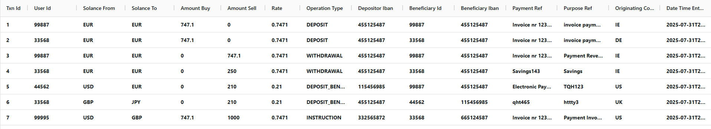
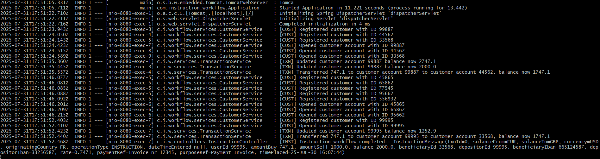

# Instruction Workflow

## Running the Application

Always a good idea to run when first cloning code to local
``` bash
   mvn clean install
```

### Command line (Maven)
``` bash
   mvn org.springframework.boot:spring-boot-maven-plugin:run
```

### Command line (Docker [App only])
``` bash
   docker build -t customer-service . 
   docker run -p 8080:8080 customer-service
```

## Running the UI 

*In /frontend directory*
``` bash
   npm start
```



#### UI Setup

*If needed* for local UI setup run the following
``` bash
   npm install ag-grid-react
   npm install ag-grid-community/react
```

## Database Implementation

H2 was chosen for this as it is agnostic and runs out-of-the-box without additional setup on the users part.

In a real-world scenario a persistent DB would be used. Note, H2 can also be used in conjunction with a file for persistence. However there are better alternative such as Postgres and Neo4J.

To view H2 database records go to [h2 console](http://localhost:8080/h2-console/) (sa/password)

## Usage

## Process Instruction Workflow (Main Workflow)

1. Register Customer 99887 (needs to be registered)
    ```bash
   curl --location --request PUT 'http://localhost:8080/customer' \
   --header 'Content-Type: application/json' \
   --data '{"userId": "99887","currency": "EUR","iban": "455125487","balance" : 2000.0,"accountStatus": "INACTIVE"}'
   ```
2. Open customer account 99887 (needs to be active)
    ```bash
      curl --location --request PATCH 'http://localhost:8080/customer/99887'
      ```
3. Run Process Instruction 44547 to 99887 (registers 44547 and transfers to 99887)
   ```bash
      curl --location --request PUT 'http://localhost:8080/instruction' \
      --header 'Content-Type: application/json' \
      --data '{"userId": 44547,"currency": "EUR","amountBuy": 747.10,"amountSell": 0.0,"balance": 2000,"originatingCountry": "IE","operationType": "INSTRUCTION","solanceFrom": "EUR","solanceTo": "GBP","amountBuy": 747.10,"amountSell": 1000.0,"beneficiaryId": "111","depositorId": "333","beneficiaryIban": "123456789","depositorIban": "123456789","rate": 0.7471,"paymentRef": "Invoice nr 12345","purposeRef" : "Payment Invoice","originatingCountry" : "FR","timePlaced" : "25-JUL-30 16:07:44"}'
      ```

### Other API Examples

1. Retrieve Customers
   ```bash
    curl --location 'http://localhost:8080/customer'
   ```
      ```bash
      curl --location 'http://localhost:8080/customer/111'
   ```
2. Register Customer
    ```bash
      curl --location --request PUT 'http://localhost:8080/customer' \
      --header 'Content-Type: application/json' \
      --data '{"userId": "111","currency": "EUR","iban": "123456789","balance" : 2000.0,"accountStatus": "INACTIVE"}'
   ```
3. Open customer account 
    ```bash
      curl --location --request PATCH 'http://localhost:8080/customer/111'
      ```
4. Create customer deposit transaction (pay-in from our customer)
    ```bash
      curl --location --request PUT 'http://localhost:8080/transaction' \
      --header 'Content-Type: application/json' \
       --data '{ "userId": "111","operationType": "DEPOSIT","amountBuy": 747.10,"amountSell": 0.0,"originatingCountry": "IE","solanceFrom": "EUR","solanceTo": "GBP","amount": 747.10,"beneficiaryId": "111","depositorId": "111","beneficiaryIban": "123456789","depositorIban": "123456789","rate": 0.7471,"paymentRef": "Invoice nr 12345","purposeRef" : "invoice payment"}'
   ```
5. Create customer payment instruction (pay-out to a beneficiary of our customer)
    ```bash
      curl --location --request PATCH 'http://localhost:8080/transaction' \
      --header 'Content-Type: application/json' \
      --data '{"userId": "111","currency": "EUR","amountBuy": 747.10,"amountSell": 0.0,"originatingCountry": "IE","operationType": "DEPOSIT_BENEFICIARY","currencyFrom": "EUR","currencyTo": "GBP","amount": 747.10,"beneficiaryId": "111","depositorId": "111","beneficiaryIban": "123456789","depositorIban": "123456789","rate": 0.7471,"paymentRef": "Invoice nr 12345","purposeRef" : "Payment Invoice"}'
   ```
   
## Logging

See example



### Legend

[CUST] - Customer Logging

[TXN] - Transaction Logging

[INST] - Instruction Logging

## Postman Collections
[Solance (Batch)](./Solance%20(Batch).postman_collection.json) <br/>
[Solance (Customer)](./Solance%20(Customer).postman_collection.json) <br/>
[Solance (Instruction)](./Solance%20(Instruction).postman_collection.json) <br/>
[Solance (Transactions)](./Solance%20(Transactions).postman_collection.json)

## Approach & Further Discussion

[approachAndFurtherDiscussion](./approachAndFurtherDiscussion.pdf)
